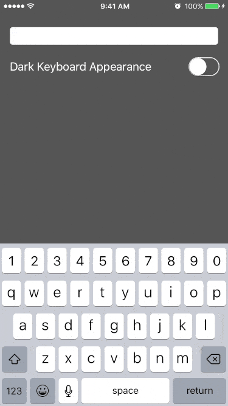

# MWKNumberRowInputAccessory
[](https://github.com/mwkirk/MWKNumberRowInputAccessory/blob/master/LICENSE)
[](https://github.com/mwkirk/MWKNumberRowInputAccessory/releases)
[](https://cocoapods.org/pods/MWKNumberRowInputAccessory)
[](https://github.com/Carthage/Carthage)

MWKNumberRowInputAccessory is an iOS input accessory view that adds a persistent number row with native look and feel to the keyboard.

Typing something like a street address or calendar entry that requires both numbers and letters is far less tedious when they're both _right there._ You love your users. Give them a persistent number row on their keyboard, and make them smile at your thoughtfulness.

<p align="center">

</p>

## Usage

Import the framework's header, adopt the `MWKNumberRowInputAccessory` protocol,
and declare a property for the number row.

Objective-C:
```objective-c
#import <MWKNumberRowInputAccessory/MWKNumberRowInputAccessory.h>

@interface ViewController () <MWKInputAccessoryViewDelegate>
@property (nonatomic, strong) id<MWKInputAccessoryView> numberRow;
@end
```

Swift:
```swift
import MWKNumberRowInputAccessory

class ViewController: UIViewController, MWKInputAccessoryViewDelegate
{
    // In Swift, you can initialize the property with a closure
    let numberRow: MWKInputAccessoryView = {
        let frame = MWKNumberRowInputAccessoryViewFactory.defaultFramePortrait()
        return MWKNumberRowInputAccessoryViewFactory.numberRowInputAccessoryView(withFrame: frame, inputViewStyle:UIInputViewStyle.keyboard)
    } ()
```

Create the input accessory view and configure it to taste. The factory abstracts away some iOS version-specifics. Assign it to the inputAccessoryView of your UITextField, UITextView, or UISearchBar, and set its delegate.

Objective-C:
```objective-c
- (void)viewDidLoad
{
    [super viewDidLoad];

    CGRect frame = [MWKNumberRowInputAccessoryViewFactory defaultFramePortrait];
    self.numberRow = [MWKNumberRowInputAccessoryViewFactory numberRowInputAccessoryViewWithFrame:frame inputViewStyle:UIInputViewStyleKeyboard];
    self.numberRow.keyboardAppearance = UIKeyboardAppearanceDefault;
    self.textField.keyboardAppearance = UIKeyboardAppearanceDefault;
    self.textField.inputAccessoryView = (UIView*)self.numberRow;
    self.numberRow.delegate = self;
}
```

Swift:
```swift
override func viewDidLoad()
{
    super.viewDidLoad()

    self.textField.inputAccessoryView = (self.numberRow as! UIView)
    self.numberRow.delegate = self
    self.changeKeyboardAppearance(nil)
}
```

Implement the single required protcol method in the delegate to capture the input accessory's keystrokes.

Objective-C:
```objective-c
#pragma mark - MWKNumberRowInputAccessoryViewDelegate

- (void)inputAccessory:(MWKNumberRowInputAccessoryView*)aInputAccessory didGenerateValue:(id)aValue
{
    NSString *currentText = self.textField.text;
    NSString *newText = [NSString stringWithFormat:@"%@%@", currentText, aValue];
    self.textField.text = newText;
}
```

Swift:
```swift
// MARK: MWKNumberRowInputAccessoryViewDelegate
func inputAccessory(_ aInputAccessory: UIView, didGenerateValue aValue: Any)
{
    guard let value = aValue as? String else { return; }
        
    let currentText: String = self.textField.text!
    let newText: String = String(format: "%@%@", currentText, value)
    self.textField.text = newText
}
```

Please see the example Swift and Objective-C projects for a test drive.

##Installation
###CocoaPods
You can install MWKNumberRowInputAccessory in your project with [CocoaPods](https://github.com/cocoapods/cocoapods) by adding this to your `Podfile`:

```Ruby
pod 'MWKNumberRowInputAccessory', '~> 1.0.0'
```

###Carthage
MWKNumberRowInputAccessory also supports [Carthage](https://github.com/Carthage/Carthage). Specify it in your `Cartfile` like this:

```
github "mwkirk/MWKNumberRowInputAccessory" ~> 1.0
```

###Manually
Since MWKNumberRowInputAccessory is just a few files, it's simple to integrate it into your project manually.

## Requirements

MWKNumberRowInputAccessory requires iOS 8.0 or higher.

Well, actually, it _should_ still work on iOS 7 and even iOS 6 (the key images are still included). Dynamic framworks were introduced in iOS 8.0, so you'll need to either integrate manually or perhaps CocoaPods can build you a static library.

## About

_"It's an older code, sir, but it checks out."_

I haven't touched this code in ages – other than some minor changes for Swift, but it's held up well from iOS 6 through iOS 10. Hopefully that's a testament to its simplicity and durability.

I wrote this to handle my use cases. There are undoubtedly better ways to do things and features missing _- like landscape support._ Pull requests welcome!

## Credits

MWKNumberRowInputAccessory was created by [Mark Kirk](https://twitter.com/postmodjackass).

## License

MWKNumberRowInputAccessory is available under the MIT license. See the LICENSE file for more info. 

Attribution or a shout-out is always appreciated!


